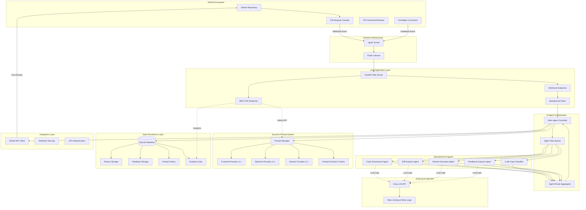
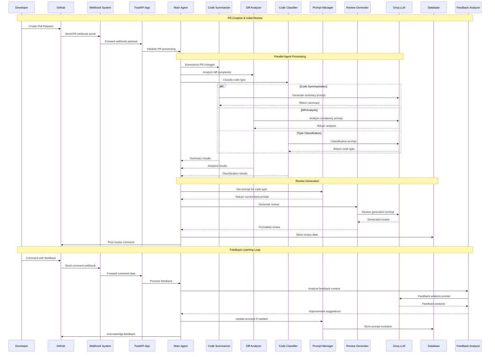
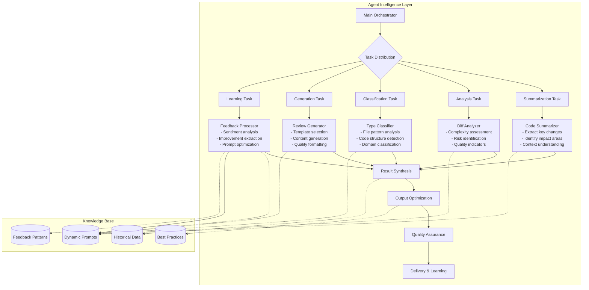
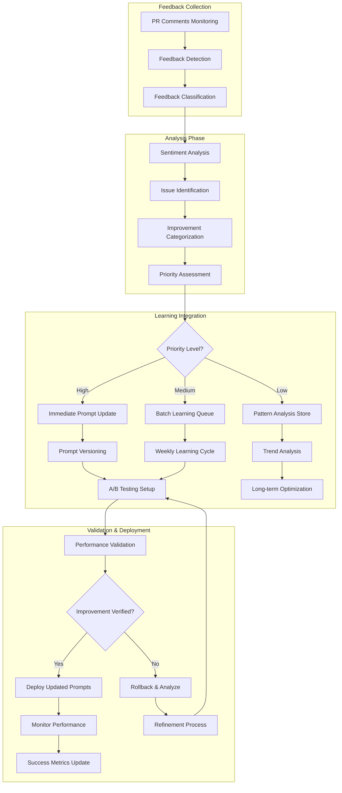
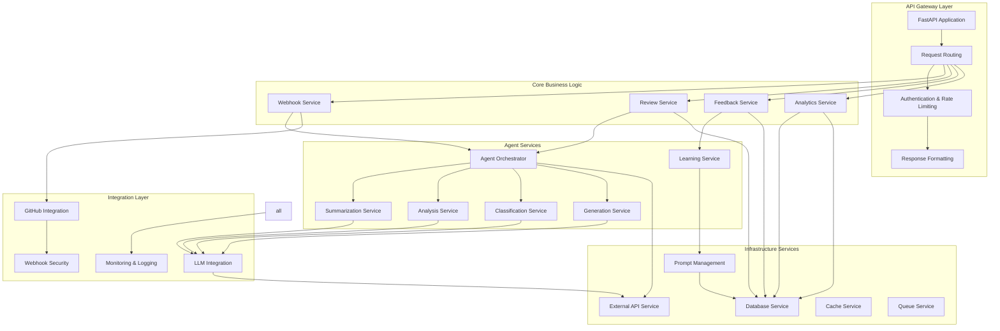
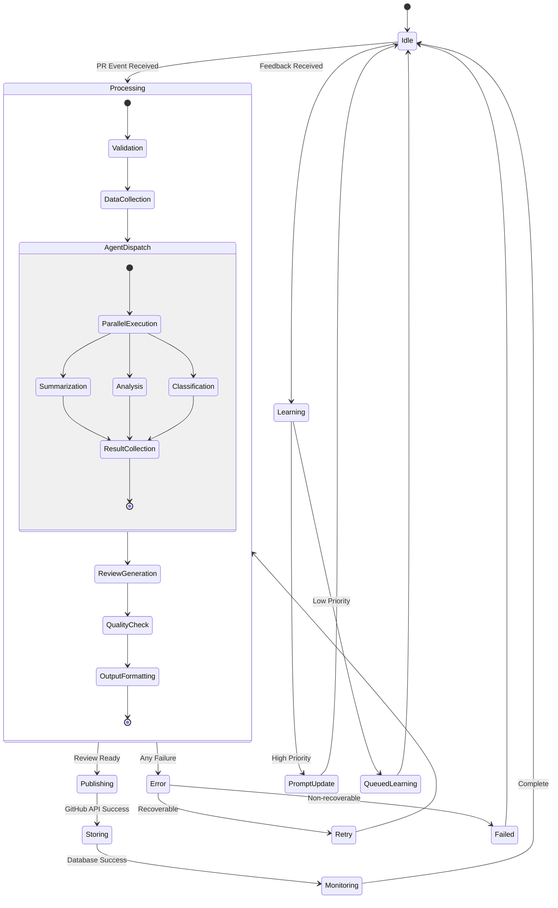
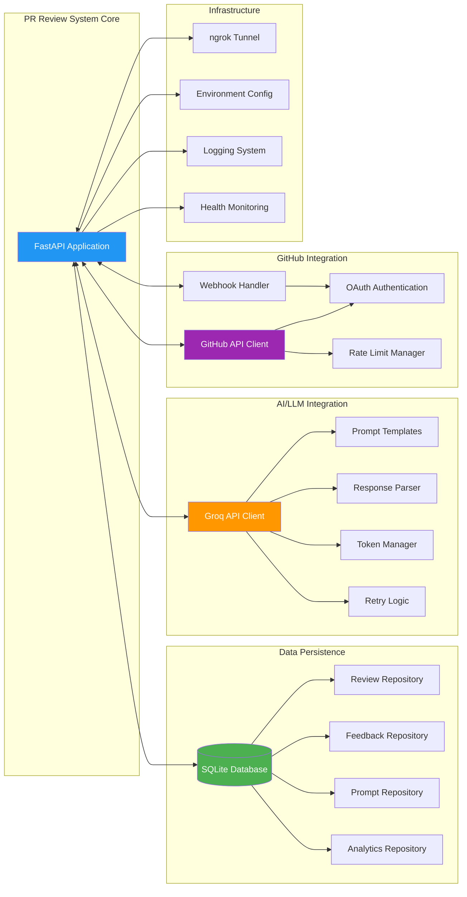
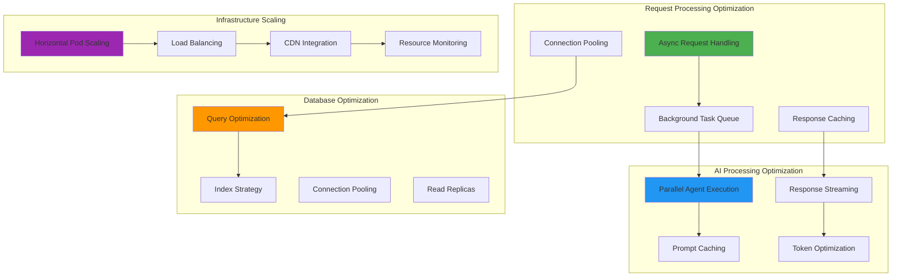

# Architecture Diagrams & Visual Workflow Guide

## System Architecture Overview

### 🏗️ Complete System Architecture



### 🔄 Agent Workflow Sequence



### 🧠 Agent Intelligence Architecture



## Data Flow Architecture

### 📊 Information Processing Pipeline

```mermaid
flowchart LR
    subgraph "Input Processing"
        A[GitHub PR Event] --> B[Webhook Validation]
        B --> C[Data Extraction]
        C --> D[Context Enrichment]
    end
    
    subgraph "AI Processing Pipeline"  
        D --> E[Agent Orchestration]
        E --> F[Parallel Processing]
        
        F --> G1[Summary Generation]
        F --> G2[Technical Analysis]
        F --> G3[Type Classification]
        
        G1 --> H[Result Aggregation]
        G2 --> H
        G3 --> H
        
        H --> I[Prompt Selection]
        I --> J[Review Generation]
        J --> K[Quality Enhancement]
    end
    
    subgraph "Output & Learning"
        K --> L[Review Formatting]
        L --> M[GitHub Integration]
        L --> N[Data Storage]
        
        M --> O[PR Comment Posted]
        N --> P[Analytics Update]
        
        O --> Q[User Feedback Collection]
        Q --> R[Feedback Analysis]
        R --> S[System Improvement]
        S --> I
    end
    
    style A fill:#e1f5fe
    style O fill:#c8e6c9
    style S fill:#fff3e0
```



### 🔄 Learning & Adaptation Flow



## Component Architecture

### 🏗️ Microservices-Style Component Design



### 🎯 Agent Interaction Model



## Technology Integration Architecture

### 🔌 External Service Integration



### 🚀 Deployment Architecture Options

```mermaid
graph TB
    subgraph "Development Environment"
        A1[Local Machine]
        B1[SQLite Database]
        C1[ngrok Tunnel]
        D1[File-based Logging]
    end
    
    subgraph "Staging Environment" 
        A2[Docker Container]
        B2[PostgreSQL Database]
        C2[Cloud Load Balancer]
        D2[Centralized Logging]
        E2[Monitoring Dashboard]
    end
    
    subgraph "Production Environment"
        A3[Kubernetes Cluster]
        B3[Managed Database]
        C3[API Gateway]
        D3[Log Aggregation]
        E3[Alert Management]
        F3[Auto-scaling]
        G3[Backup System]
        H3[Security Scanning]
    end
    
    A1 --> A2: Docker Build
    A2 --> A3: K8s Deploy
    
    B1 --> B2: Migration Scripts
    B2 --> B3: Database Upgrade
    
    C1 --> C2: DNS Configuration
    C2 --> C3: Production Gateway
    
    D1 --> D2: Log Standardization
    D2 --> D3: Enterprise Logging
    
    style A1 fill:#FFF9C4
    style A2 fill:#E8F5E8
    style A3 fill:#E3F2FD
```

## Performance & Scalability Architecture

### ⚡ Performance Optimization Strategy



### 📈 Scalability Considerations

```mermaid
graph LR
    subgraph "Current State (MVP)"
        A[Single Instance]
        B[SQLite Database]
        C[Synchronous Processing]
        D[File Logging]
    end
    
    subgraph "Scale Level 1 (10-50 PRs/day)"
        E[Load Balanced Instances]
        F[PostgreSQL]
        G[Async Processing]
        H[Structured Logging]
    end
    
    subgraph "Scale Level 2 (100-500 PRs/day)"
        I[Microservices Architecture]
        J[Database Clustering]
        K[Message Queues]
        L[Distributed Logging]
    end
    
    subgraph "Scale Level 3 (1000+ PRs/day)"
        M[Container Orchestration]
        N[Managed Database Services]
        O[Event-Driven Architecture]
        P[Observability Platform]
    end
    
    A --> E: Traffic Increase
    E --> I: Feature Complexity
    I --> M: Enterprise Scale
    
    B --> F: Data Growth
    F --> J: Performance Needs
    J --> N: Operational Excellence
    
    C --> G: Response Time Requirements
    G --> K: Reliability Needs
    K --> O: Scalability Requirements
    
    D --> H: Debugging Needs
    H --> L: Operational Visibility
    L --> P: Full Observability
```

---

*Architecture Documentation Version: 1.0 | Last Updated: May 3, 2026*